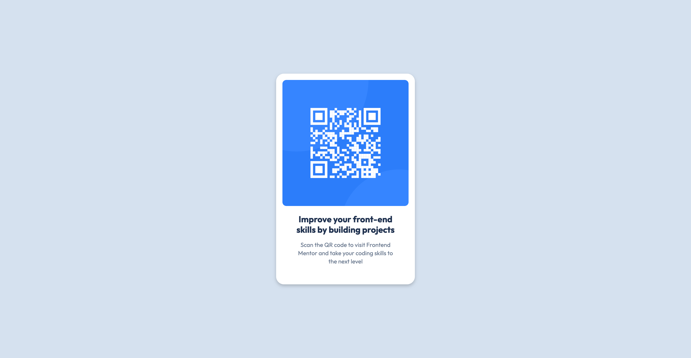

# Frontend Mentor - QR code component solution

This is a solution to the [QR code component challenge on Frontend Mentor](https://www.frontendmentor.io/challenges/qr-code-component-iux_sIO_H). 

## Table of contents

- [Overview](#overview)
  - [Screenshot](#screenshot)
  - [Links](#links)
- [My process](#my-process)
  - [Built with](#built-with)
  - [What I learned](#what-i-learned)
  - [Continued development](#continued-development)
  - [Useful resources](#useful-resources)
  - [AI Collaboration](#ai-collaboration)
- [Author](#author)
- [Acknowledgments](#acknowledgments)


## Overview

### Screenshot

| Desktop | Mobile |
|---------|--------|
|  |  |


### Links

- Live Site URL: [Live Site](https://estebanrodriguez28.github.io/qr-code-component/)

## My process

### Built with

- Semantic HTML5 markup
- CSS 
- Flexbox


### What I learned

- How to center a div with flexbox importantly running into the bug that a height has to be set for the parent flex container to center the card in the screen
    - Flexbox is a way to arrange items in a row or column, there is a parent container known as the flex container which must have display set to flex. Importantly the flex container have a height set as flexbox is just a way to arrange items 
    - I used viewport to center the qr code, view height is with the unit vh however there's dynamic view port (dvh) where if theres changes in the screen, like on mobile where the address bar can collapse, the viewport is automatically adjusted making sure the ui stays consistent

```html
<div class="container">
<!-- 
    Rest of html (the actual qr code component)
    -->

</div>
```
```css
.container {
    display: flex;
    justify-content: center;
    align-items: center;
    min-height: 100dvh;


}
```

- Browsers have a built in margin so for projects you can reset the margin like this

```css
body {
    margin: 0;
    background-color: #D5E1EF;
}
```

- Max-width is better than width in creating responsive uis as say your using px but for smaller screens they dont have enough width or height for that px then it goes off screen. If use max-width or max-height instead the content adjust based on screen size

```css
.qr-image {
    border-radius: 10px;
    max-width: 100%;

}
```

- A small detail but for importing the google fonts in the html I had to import for the specific font both the regular weight and the bolded version of the font. Not sure why but when I only did regular weight and for the bold text tried to set it to bold with font weight:
```css 
font-weight: bold
```
In dev tools that property was struck through, it was being overidden somehow. Maybe the fact I was importing only the font as unbolded was overriding that css. Also I was missing the preconnect parts for the google apis which was not allowing me to get the font, so those should be included as well in future for using google fonts.

```html
<link rel="preconnect" href="https://fonts.googleapis.com">
<link rel="preconnect" href="https://fonts.gstatic.com" crossorigin>

<link href="https://fonts.googleapis.com/css2?family=Outfit&display=swap" rel="stylesheet">

<link href="https://fonts.googleapis.com/css2?family=Outfit:wght@700&display=swap" rel="stylesheet">
```

- Theres semantic vs non semantic html. Non semantic html like 
```html
<div>
<span>
```
 do not convey the meaning of what they do. Semantic means the tags clearly convey the meaning of what they represent. For example I used the section tag to implement semantic  html: 
 ```html
 <section>
```
 There are other semantic tags like:
 ```html
<nav>
<footer>
<header>
<main>
```

Semantic html helps with ascessibility and SEO.

### Continued development

I ran into a problem with inspecting the figma file and converting it to html/css. Specifically the spacing, I noticed that I had to add more padding in the css of the div for the text to get the card text to look like the figma design. When I inspected the figma design the spacing I saw was less than the actual spacing I put.

In the future want to get more comfortable with Figma and translating the design to code as accurately as possible. Potentially learning Figma myself so I can understand its advantages and limitations like spacing.

Also, I would like to focus on mobile first development in the future. Starting out developing on mobile then move up to larger screens. This way I can follow best practices and can make the website look great for mobile, which most people are on.


### Useful resources

- [Centering Div](https://dev.to/amoreno/3-ways-to-center-a-div-in-css-that-actually-work-30ge) - This helped me to center a div with flexbox using viewport. Blog posts like this are really helpful.
- [Centering Div Flexbox Mistake](https://blog.devgenius.io/why-your-flexbox-isnt-centering-the-hidden-css-mistake-beginners-make-98baa3738588?gi=a693f27c081c) - This article helped me understand why the card was not being centered vertically on the page. Explained you need to add a height to the flex container.
- [Figma to Code](https://www.frontendmentor.io/articles/figma-for-developers-how-to-work-with-a-design-file-m6CZKZ1rC1) - Article for converting Figma designs into code

### AI Collaboration

- I wrote this code mostly myself, using resources like w3schools for finding css and html like how to make a div into a card
- I did use Claude for trying to understand why the spacing in Figma was different than the padding I put to make the ui match. I also asked why when I set a div to 100vh and set a background color there is still some white space which is where I learned about the built in margins for every web page.
- I generally used Claude for understanding, why certain things werent working. I would like to use ai like this in the future, focusing on understanding and learning.


## Author

- Frontend Mentor - [@estebanrodriguez28](https://www.frontendmentor.io/profile/estebanrodriguez28)


## Acknowledgments

The several articles and blog posts helped me learned and develop important understanding in html/css. I would like to thank the authors of those resources as well as front end mentor for giving me the structure and flexibility to learn web development the right way.


